# FugueStat

Perform visual music-based fugal analysis using subjects, countersubjects, and their transformations.

## Setup

Requires: **python-3.10+**

```bash
pip install -r requirements.txt
```

Libraries: **pyyaml**, **numpy**, **pytest**

## Usage

```bash
python3 main.py <file_name>.<file_extension> [--debug] [--logfile=log.txt]
```

Resulting file is found at `<file_name>_annotated.<file_extension>`.

## Prerequisites (temporary)

- [x] Music file should only contain _1 single_ fugue $^1$
- [x] No voice discontinuities should occur where a stream of notes is intuitively continuous within a single voice $^2$
- [x] Fugue should begin with a single solo voice stating the subject
- [x] A time signature is required for all measures

$^1$ This condition can be relaxed in the future by requiring titles of fugal sections to contain certain keywords.

$^2$ Mentioned in [TO-DO List](#to-do-list), some alleviation will be provided through intelligent voice joining, but try best to avoid this issue.

## File import and export

The current supported file reading and writing formats are:
- *.musicxml*

## Terminology
**Fugue**: A contrapuntal composition in which a short melody or phrase (the subject) is introduced by one part and successively taken up by others and developed by interweaving the parts.

*Notable examples for solo piano*:
- Johann Sebastian Bach: *Well-Tempered Clavier 1 & 2* (48 fugues total of all key signatures)
- Ludwig van Beethoven: *Grosse Fuge, Op. 133*
- Ludwig van Beethoven: *Piano Sonata No.28, 29, 31*
- Dmitri Shostakovich: *24 Preludes and Fugues, Op. 87*
- Karol Szymanowski: *Piano Sonata No.2, 3*
- Elliott Carter: *Piano Sonata*
- Kaikhosru Shapurji Sorabji: *Opus Clavicembalisticum* (+ many others)

*(I currently work on the most accurate solo piano performance rendition of "Opus Clavicembalisticum" in history.)*

**Voice**: In a contrapuntal composition, a contiguous and related series of notes which forms a single layer. Like a human voice, it is often both independent and dependent on the concurrent progression of other voices. The majority of fugues are written with 3-4 voices, though some by *Kaikhosru Sorabji* can go up to 8 concurrent voices.

**Interval**: The semitone distance between any two notes. + for ascending, - for descending.

**Subject**: A musical theme introduced as a solo voice at the start of a fugue. The subject is the main focus of the fugue and can undergo subtle to dramatic alterations and transformations as the fugue progresses.

*Alterations include*:
- Entire translation up/down in pitch
- Decreasing/increasing 1 or more intervals' sizes.
- Contiguous partial statement of the subject/countersubject.
- Inserting/deleting a small number of notes from fugal elements.

*Transformations include*:
- *Reversal*: Stating the subject with all the intervals in reverse order.
- *Inversion*: Stating the subject with all the intervals' directions inverted.
- *Reversal & Inversion*: Stating the subject with simultaneous *reversal* and *inversion*.
- *Augmentation*: Stating the subject where each note's duration is 2 or more times longer in duration.
- *Diminution*: Stating the subject where each note's duration is 2 or more times shorter in duration.

**Countersubject**: Material articulated by a second voice which accompanies the second statement of the subject immediately after the first statement completes.

*Countersubjects can undergo similar alterations and transformations as the subject.*

## Problem

In standard music theory, common tasks include performing manual analysis of fugal elements in a piece of music either for academic purposes or to aid in the process of learning to play such pieces of music. Typically, such procedures, done manually, are completely manageable within a reasonable timeframe and have very high accuracy as identification of fugal elements are, more intuitively, a human task. However, personally being a [greenfield performer](https://www.youtube.com/playlist?list=PLIDZcmE0XODBZjc2ISVcJB9--pTWaWRME) of *Kaikhosru Sorabji*'s solo piano works which often contain fugues ranging from 10 minutes to 2 hours in length along with some of the most complex contrapuntal conceptions in all of history, automated analysis could save a massive amount of time.

*Example: Fugue 1's subject from Bach's Well-Tempered Clavier 1*
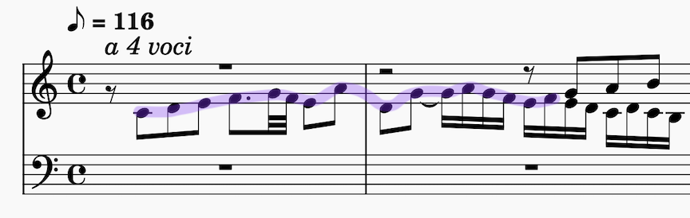

*Example: Contrapuntally dense section from Fugue 1 from Bach's Well-Tempered Clavier 1*
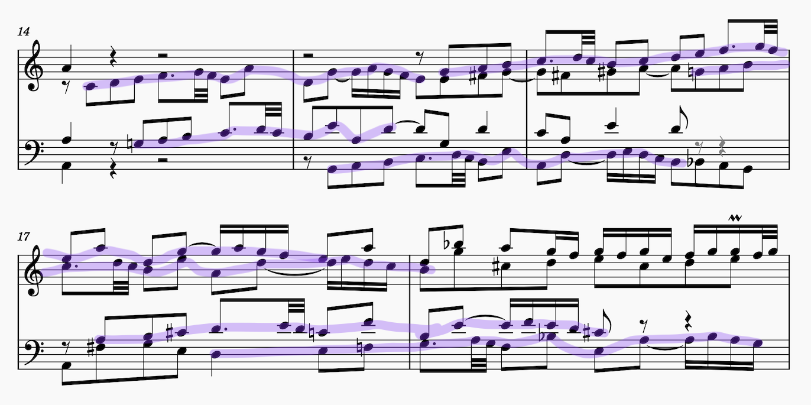

With increasing complexity, this process becomes much less trivial (yes, that is solo piano):

*Example: "XI. Fuga IV [Dux Tertius]" from Sorabji's Opus Clavicembalisticum*
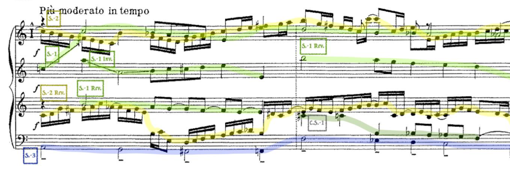

## Solution

The solution is inspired by the domain of fuzzy string matching. Fuzzy string matching involves determining whether two strings $A$ and $B$ have some degree of close enough similarity to be considered a match. Applications commonly include DNA sequencing and auto-correction. *e.g.* `"heapt"` has close resemblance to `"heart"`.

The metric for closeness I employ in my algorithm design is the well-known *edit distance*, with many alterations to account for the additional requirements that matching music notes imposes.

However, unlike typical applications of *edit distance*, it is not matched based on the absolute pitch of each note. Because the entire nature of a fugue consists of modulation to other keys and thematic exploration, it is to be expected that entire translations of the initial subject is the norm. Thus, the intervals between the notes encode more information than the notes themselves.

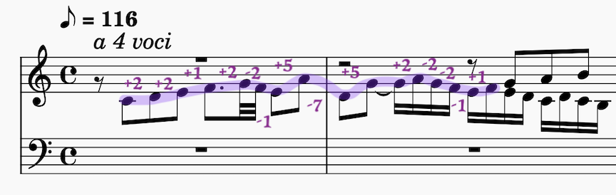

Using the sequence of *intervals* as the basis for fuzzy matching, it's now possible to account for interval contractions/dilations in subsequent subject statements. One can think also of this as "soft" matching.

In the code and here, we will refer to a *voice* as a **note sequence** or **stream**. The subject is synonymously called the **pattern**. The *stream* is almost always longer than the *pattern*, and like its name suggests, the *stream* continuously provides a window (i.e. a buffer) for the *pattern* to iteratively match over the entire piece of music. Again, recall that the *intervals* are used, not the absolute pitches. Let's refer to the length of the sequence of intervals for the stream and pattern to, respectively, be $S$ and $P$. Note, it should be apparent that, in code, voices are treated as separate entities as *note sequences* and are processed independently, even though notes do coincide between voices.

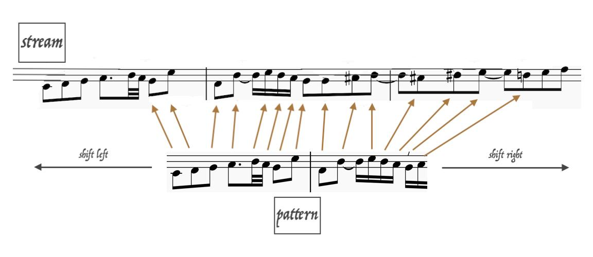

There are two clear issues with what is shown above. Because note insertion/deletion is possible for the stream, a window size fixed to the length of the pattern is insufficient to capture all likely alterations. Thus, a reasonable assumption to make is that the number of matched notes in the stream is at most some factor $n$ times the size of the pattern sequence intervals $P$. A typical factor is $2$.

There are two levels to the entire algorithm. The lower-level algorithm does something analogous to fuzzy substring matching and the higher-level algorithm controls optimized window propagation.

### Window matching

Let us assume we have a stream window of length $2P$ and pattern length $P$. A typical implementation of edit distance between the stream and pattern calculates the distance between both entire sequences. The issue with this approach is that intermediate edit distance values calculate distance from the start of the stream, which would include costs that are irrelevant.

Assuming the memoization matrix is of dimension $(S + 1) \times (P + 1)$, a known solution is to begin the algorithm by filling the first column with $0$ (to indicate $0$ cost of shifts) and the typical cumulative sum of costs of the absolute value of each interval value in the pattern sequence for the first row. The matrix is then filled *bottom-up* based on the diagram below and associated recurrence relation where the *stream* and *pattern* are denoted *s* and *p* respectively. Edit distance function is denoted by $E$.

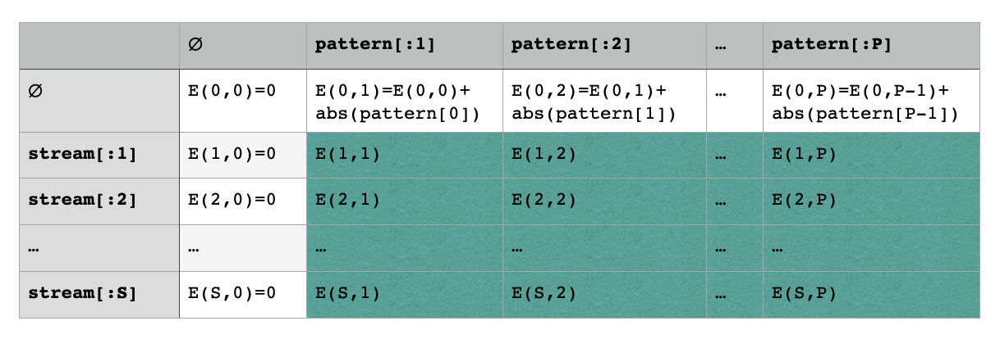

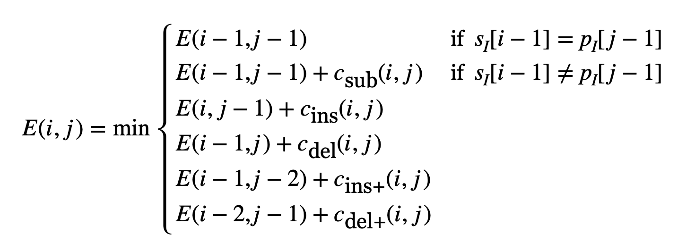

Observe that, unlike typical edit distance, there are two additional cases at the bottom which are unique to this context. $c_\text{sub}$ refers to the substition of an interval, i.e. contraction/dilation. $c_\text{ins}$ and $c_\text{del}$ are typical necessary edit distance computation features. $c_\text{ins+}$ accounts for the case of note insertion and $c_\text{del+}$ accounts for the case of note deletion. The formal definition of the various costs:

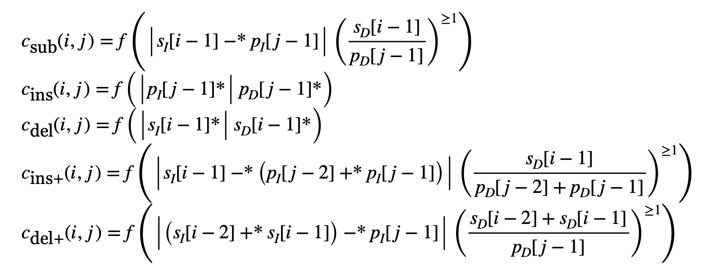

Operators and values with an asterisk denote edge case handling for rests in the music where intervals are not applicable (i.e. interval between note and rest does not exist). These edge cases are important and do actually affect the outcome of the matching results. Absolute differences are used to model "distance". Finally, a scaling function $f$ is applied to the absolute difference to level off cost as the difference grows. The function is typically $f(x)=\sqrt{cx}$ for some $c\in\mathbb{N^+}$ to avoid one single large interval deviation from preventing the pattern from matching.

The visual motivation for the definitions of $c_\text{ins+}$ and $c_\text{del+}$ are shown below. "Insertion" and "deletion" are just arbitrary semantics in this case, but the idea for the costs are based off of the observation that the compression of the intervals as a result of the added note should sum up to remain constant as before.

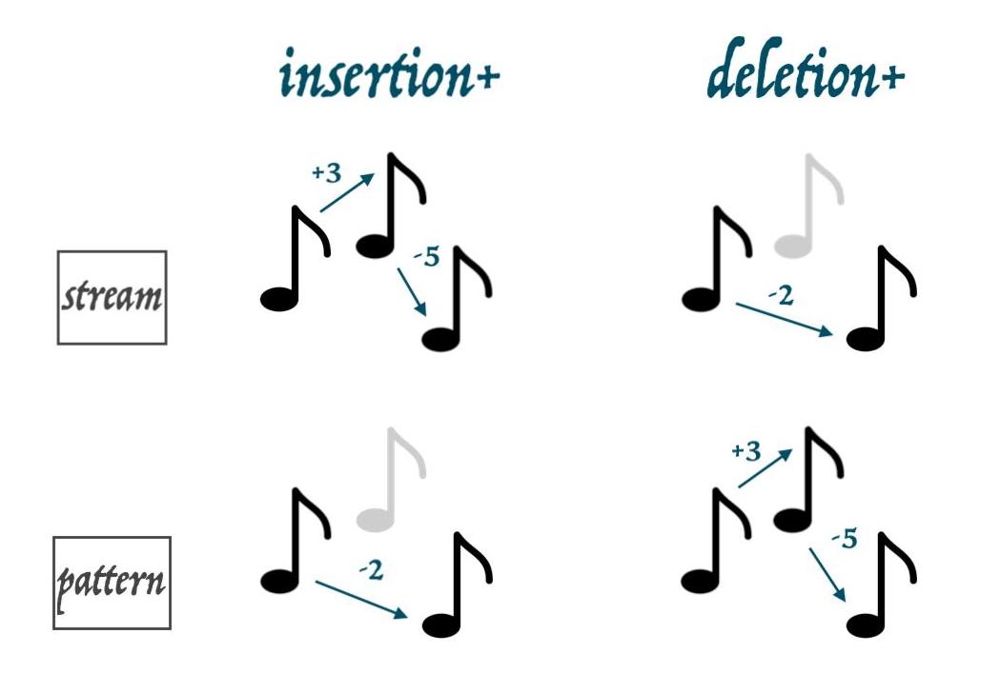

Finally, the last step in this lower-level part of the algorithm is to retrieve the entry in the matrix with the lowest edit distance while maximizing match length. This is done slightly differently than normal, and is instead done by first computing the *highest* index entry of the lowest edit distance value of the *last* column of the matrix. The last column represents the substring edit distance between each of `stream[:1]`, `stream[:2]`, ..., `stream[:S]` and `pattern`. In more concise terms, the starting match index is:

```python
(i, j) := (S - np.argmin(np.flip(memo[:, -1])), P)
```

However, notice that this initial pair of indices forces the entire pattern to be matched, which isn't always the case since a partial subject match is also possible. Thus, if the adjacent indices listed below (top and left) contain a _strictly_ smaller $E$ value, then move `(i, j)` to that new position. Rince and repeat until the position is stable. It must be *strictly* smaller as an equal value doesn't optimize to a maximum number of stream and pattern values. The final value of `(i, j)` is used as `s[:i]` and `p[:j]` and is the ***right-truncated*** substring match of *pattern* for *stream*. This is not the optimal answer, but the next section will cover how to get it.

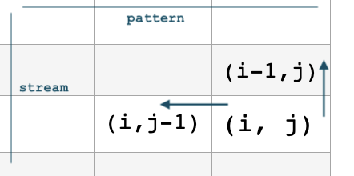

### Window propagation

As concluded at the end of the previous section, the modified edit distance algorithm computes the *right-truncated* substring match of *pattern* for *stream*. Let us denote this by $M(s,p)$.

This next step kills two birds with one stone. With the initial inspiration being the *Knuth-Morris-Pratt* (KMP) algorithm, which is one of the most widely implemented practical hard (vs. soft) string matching algorithms, this step can effectively replace a usage of KMP for efficient window propagation.

There are 5 orientations for how an ideal pattern match can manifest in a stream. A 6th orientation where the ideal match is cut off on the left side is not applicable, but it'll be clearer why that is the case later.

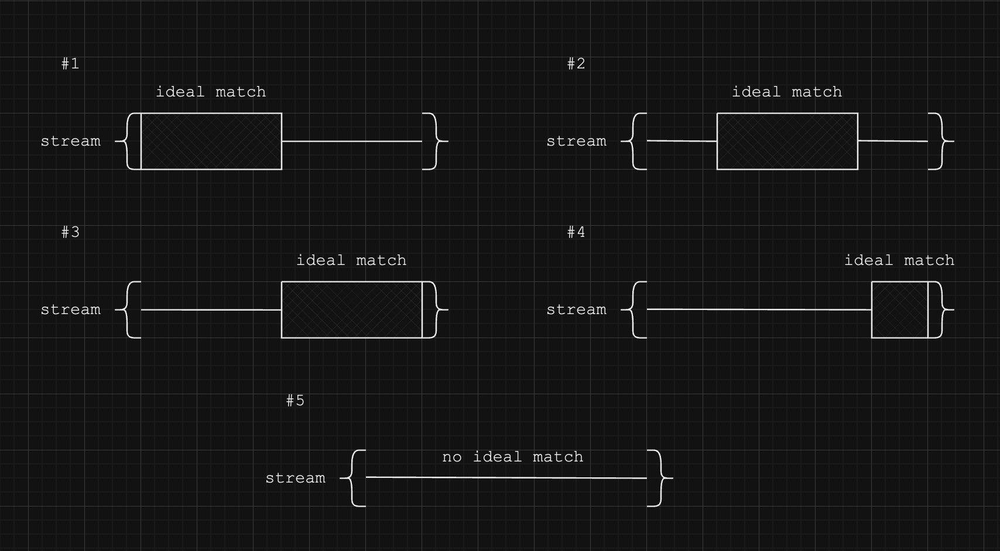

Because the $M(s,p)$ substring match of *stream* and *pattern* is *right-truncated*, it does not offer the ideal match for case $2, 3, \text{and } 4$. The solution is then to perform a *left-truncated* substring match of *stream* and *pattern* first and then proceed it by a *right-truncated* version. The *left-truncated* version is achieved simply by reversing the *stream* and *pattern*. The pseudocode is below:

```python
(r_s, r_p) = (s.reversed(), p.reversed())
(r_i, r_j) = M(r_s, r_p);
(s', p') = (r_s[:r_i].reversed(), r_p[:r_j].reversed())
(i', j') = M(s', p')
```

And, voilà, `s'[:i']` is the optimal substring match for `p'[:j']`. The irrelevant fluff was first stripped from the left and then the other irrelevant fluff was stripped from the right.

How about window propagation? The key to the solution is the fact that a *left-truncated* substring match was performed first. This procedure can serve both to *left-truncate* and to *propagate to the right*. It also serves to left-align the ideal match so the left side of the match isn't cut off by the progressing stream.

The *left-truncation* algorithm can be repeatedly applied starting at any state $2, 3, 4, \text{or } 5$ until it reaches state $1$, where the *right-truncation* algorithm finishes things off. In code, this is simply checked by verifying that the offset produced by the *left-truncation* to be $0$.

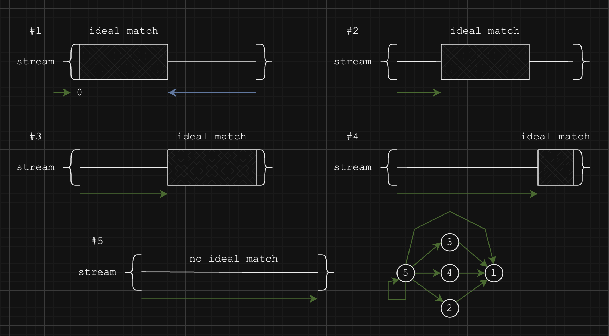

And, thus, all the optimal matches are found. The only caveats to this implementation is that after state $1$ completes, the starting position of the stream window is moved forward the length of the match, and after state $5$ completes, only $P$ steps are taken forward, not $2P$.

## Time complexity

Each window matching iteration is $O(SP) = O(2P * P) = O(P^2)$ due to the computation of edit distance.

Each window matching limit searching iteration is $O(S + P)$.

Each *left-truncation* operation is proceeded by at most one *right-truncation* operation. Let $L$ be the *voice* with the maximum number of notes. Then, the number of window propagation operations is $O\left(\frac{L}{P}\right)$.

So, the total time complexity is $O\left( \frac{L}{P} * S * P \right) = O\left( \frac{L}{P} * P^2 \right) = O(LP)$.

## TO-DO List

- [ ] Automated intelligent voice joining $^1$
- [ ] Subject transformation detection
- [ ] Note duration inclusion in edit distance
- [ ] Remove need for time signature
- [ ] Fugue detection with score through keyword title matching

$^1$ Mainly because of human score design, at some points, the voice assignment of a relatively continuous stream of notes changes even though it shouldn't. This can cut a subject into pieces across various voices which causes detection to fail. Therefore, at such cut boundaries, try as best as possible to rejoin the pieces.
